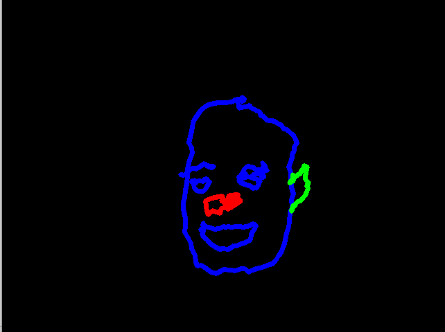

# Computer-Vision-Mediapipe
Container for trying out the possibilities of [MediaPipe](https://mediapipe.dev/). 

- Scripts 1 to 6 are the basics of mediapipe.
- Script 7 is the implementation of a volume control with 2 fingers (without access to the system volume), just proof of concept
- Script 8 is the implementation of a push-up counter (record a video of you making push-ups and run the script on it)
- Script 9 is the implementation of a drawing software, which takes the fingers of the hand as guide for the brush. An example is the drawing of me 



Enjoy trying it out


# author
```
Eric Schmidt
```
